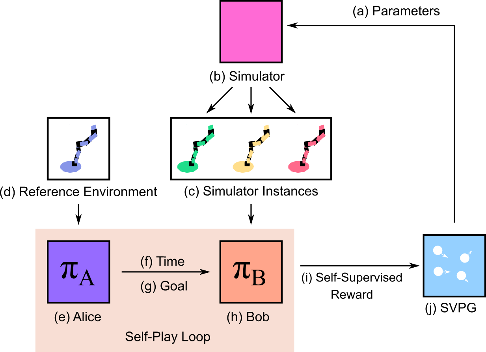

# Unsupervised Active Domain Randomization 
This repository provides official code base for the paper "Generating Automatic Curricula via Self-Supervised Active Domain Randomization".

## Experiments
We perform our experiments on ErgoReacher, a 4 DoF arm and ErgoPusher, a 3-DoF arm from both in simulation and on the real robot.
### Important Flags
There are few important flags which differentiate various experiments. `--approach` specifies the approach ['udr' | 'unsupervised-default' | 'unsupervised-adr'], `--sp-percent` flag specifies the self-play percentage. For all out experiments we use either `--sp-percent=1.0` (full self-play/completely unsupervised) or `--sp-percent=0.0` (no self-play,/completely supervised) depending on the `--approach`.  `--only-sp` specifies where the bob operates. It is `True` for `--approach=unsupervised-default` and `False` for `--approach=unsupervised-adr`. For all the reacher experiments we used `--n-params=8` and for pusher experiments we used `--n-params=1`.   

### Uniform Domain Randomization 
For `ErgoReacher` baseline experiments:

`python  experiments/ddpg_train.py  --sp-percent 0.0 --approach 'udr' --env-name='ErgoReacherRandomizedEnv-Headless-v0' --n-params=8 `

For `ErgoPusher` baseline experiments:

`python  experiments/ddpg_train.py  --sp-percent 0.0 --approach 'udr' --env-name='ErgoPushRandomizedEnv-Headless-v0' --n-params=1`

### Unsupervised Default 
For `ErgoReacher` experiments:

`python  experiments/ddpg_train.py  --sp-percent 1.0 --approach 'unsupervised-default' --only-sp=True  --env-name='ErgoReacherRandomizedEnv-Headless-v0' --n-params=8 `

For `ErgoPusher` experiments:

`python  experiments/ddpg_train.py  --sp-percent 1.0 --approach 'unsupervised-default' --only-sp=True  --env-name='ErgoPushRandomizedEnv-Headless-v0' --n-params=1`

### Unsupervised Active Domain Randomization
For `ErgoReacher` experiments:

`python  experiments/ddpg_train.py  --sp-percent 1.0 --approach 'unsupervised-adr' --only-sp=True  --env-name='ErgoReacherRandomizedEnv-Headless-v0' --n-params=8`

For `ErgoPusher` experiments:

`python  experiments/ddpg_train.py  --sp-percent 1.0 --approach 'unsupervised-adr' --only-sp=True  --env-name='ErgoPushRandomizedEnv-Headless-v0' --n-params=1`

## Evaluations
In order to evaluate the trained models on simulator, on the command line execute the following. 

Here `--mode` can be `[default | hard]`. Here is an example to evaluate `ErgoReacher` in default environment. You can likewise evaluate `ErgoPusher` with different modes.  
 
`python experiments/evaluate_ergo_envs.py  --env-name "ErgoReacherRandomizedEnv-Headless-v0"  --mode='default' --sp-polyak 0.95 --n-params=8`

## Reference
coming soon.

Built by [@Sharath](https://sharathraparthy.github.io/) and [@Bhairav Mehta](https://bhairavmehta95.github.io/)
